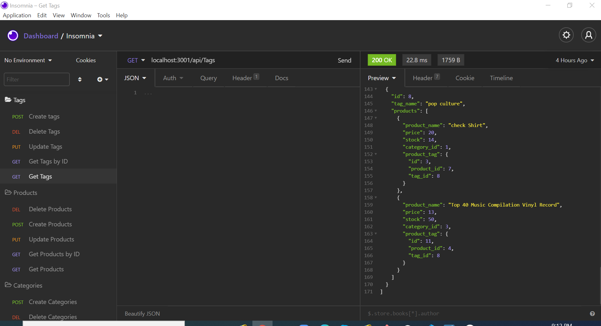
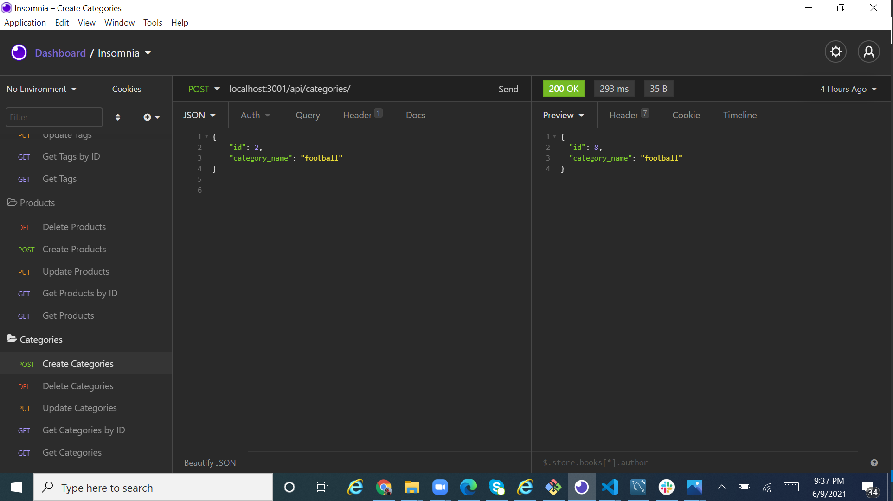
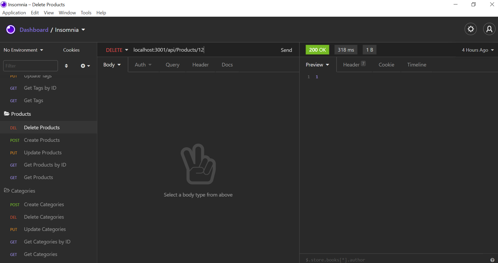

# Ecommerce_Backend

## Description 

This applications is the backend for an for an e-commerce site. This is built using MySQL database,Express,Sequelize and dotenv.

Walkthrough Video -

> - Categories-https://drive.google.com/file/d/1gCORLY7mVkGQcnX-p566GC3PetnUM39T/view
> - Products-https://drive.google.com/file/d/1f7ItHYofsVuie-J8roj_SH_Lf0svWhzL/view
> - Tags- https://drive.google.com/file/d/1rmVGd_A-ysL1p1mDV9wO8vGppPJCWimy/view 


## User Story

```md
AS A manager at an internet retail company
I WANT a back end for my e-commerce website that uses the latest technologies
SO THAT my company can compete with other e-commerce companies
```

## Acceptance Criteria

```md
GIVEN a functional Express.js API
WHEN I add my database name, MySQL username, and MySQL password to an environment variable file
THEN I am able to connect to a database using Sequelize
WHEN I enter schema and seed commands
THEN a development database is created and is seeded with test data
WHEN I enter the command to invoke the application
THEN my server is started and the Sequelize models are synced to the MySQL database
WHEN I open API GET routes in Insomnia Core for categories, products, or tags
THEN the data for each of these routes is displayed in a formatted JSON
WHEN I test API POST, PUT, and DELETE routes in Insomnia Core
THEN I am able to successfully create, update, and delete data in my database
```
### Installation 
 ```
npm init
npm install mysql2
npm install sequelize
npm install dotenv
```
## Usage

Run the following command at the root of your project and answer the prompted questions:
```
mysql -u root -p
source db/schema.sql
quit
npm run seed
npm start
```

## Github Repo 
https://github.com/poly-singh/Ecommerce_Backend/tree/main/Develop 

## Application snapshots



